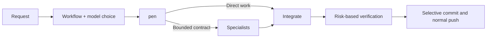

<div align="center">


# oh-pencode

### One primary agent. Six specialists. One uninterrupted delivery loop.

An autonomous agent system installer for OpenCode V2.

[Install](#install) · [How it works](#how-it-works) · [Agents](#agent-system) · [Models](#model-assignment) · [Documentation](https://b-hs.github.io/oh-pen/docs/index.html)

</div>

oh-pencode installs `pen` as the single primary OpenCode V2 agent and hides the built-in `build` and `plan` agents. `pen` owns the request from understanding through delivery: it works directly or delegates to a specialist, reviews the integrated diff, runs proportionate verification, creates a Conventional Commit, and performs a normal push without repeatedly asking for routine approval.

| At a glance | Contract |
| --- | --- |
| Primary agent | `pen` |
| Specialists | `sub-pen`, `research-pen`, `explore-pen`, `doc-pen`, `verify-pen`, `security-pen` |
| Models | Convention defaults, primary inheritance, or any connected `provider/model#variant` |
| Delivery | Verify → selective staging → commit → normal push |
| Install target | Global `~/.config/opencode/` only |
| Integrity | SHA-256 verification before installer execution |

## Install

Requirements: [OpenCode V2](https://opencode.ai/v2/docs/) and [Bun](https://bun.sh/).

```bash
curl -fsSL https://b-hs.github.io/oh-pen/install.sh | bash
```

The installer interviews you once for model assignment, shows the planned changes, verifies every downloaded asset against `manifest.json`, and backs up managed files before writing.

Preview the exact plan without changing files:

```bash
curl -fsSL https://b-hs.github.io/oh-pen/install.sh | bash -s -- --dry-run
```

Use convention model defaults without the interview:

```bash
curl -fsSL https://b-hs.github.io/oh-pen/install.sh | bash -s -- --no-interview
```

### Lifecycle commands

| Command | Purpose |
| --- | --- |
| `install` | Install the agent set and create a backup before managed writes |
| `verify` | Compare the installed files and OpenCode runtime interpretation with the manifest |
| `upgrade` | Refresh managed assets while preserving supported user changes |
| `uninstall` | Remove managed files and restore the previous configuration |

```bash
curl -fsSL https://b-hs.github.io/oh-pen/install.sh | bash -s -- verify
curl -fsSL https://b-hs.github.io/oh-pen/install.sh | bash -s -- upgrade
curl -fsSL https://b-hs.github.io/oh-pen/install.sh | bash -s -- uninstall
```

## How it works

Before a new tool-using task begins, `pen` asks once for both choices:

1. Use the multi-agent workflow or let `pen` work directly.
2. Keep the installed GPT role defaults, inherit the primary model, or assign connected models per role.

The installed Sol, Terra, and Luna assignment remains the recommended default. After the answer, routine delivery proceeds without repeated approval prompts.



1. `pen` reads the request and project contract, then asks for workflow and model choices before using tools.
2. It works directly when workflow is declined, or assigns independent units to the relevant specialists when selected.
3. It checks specialist evidence against the actual files and diff, resolves overlap, and keeps integration ownership.
4. It runs the smallest verification that directly covers the changed risk.
5. For change requests, it selectively stages only the intended files, commits, and normally pushes.

The workflow stops only at a real boundary: new authority, secrets, a destructive or hard-to-recover operation, or a missing product decision that materially changes the requested contract.

## Agent system

| Agent | Ownership | Allowed surface |
| --- | --- | --- |
| `pen` | Request analysis, orchestration, integration, verification decision, commit, push | Project tools and normal Git; force push denied |
| `sub-pen` | Implementation inside a detailed work contract | Project tools; Git mutation and nested delegation denied |
| `research-pen` | External facts, constraints, and prerequisites | Read, search, web |
| `explore-pen` | Codebase structure, symbols, and established patterns | Read and search; no network or mutation |
| `doc-pen` | Official usage and API contracts that should remain with the project | Read, search, web, edit under `docs/**` only |
| `verify-pen` | Independent checks matched to the actual change risk | Read, search, shell; no source or Git mutation |
| `security-pen` | Secrets, auth, input boundaries, injection, and dependencies | Read, search, web, package-manager audit commands |

Each specialist is intentionally narrower than `pen`. Subagents do not commit, push, or create nested subagents; the primary agent keeps a single integration and Git owner.

## Model assignment

The installer supports three assignment modes for every role:

- **Convention defaults** provide a ready-to-run model mix.
- **Primary inheritance** uses the primary session model for a selected specialist.
- **Direct assignment** accepts any OpenCode-connected `provider/model#variant` value supplied by the user.

Assignments are installation defaults, not a permanent restriction. At each new tool-using task, `pen` offers the installed GPT mix, primary-model inheritance, and direct per-role assignment. The GPT defaults use native child agents; inheritance or direct assignment runs the selected role with `opencode run --agent <role> --model <provider/model#variant>` in a separate CLI session. `pen` supplies a complete work contract and integrates the result. It reports an unavailable model instead of silently substituting another one.

Installation defaults live on the `model:` line in `~/.config/opencode/agents/<id>.md`. Task-specific choices do not edit those files or the root config. The primary session model is stored separately; a `model:` field inside `agents/pen.md` does not change an active primary session.

Reinstall and upgrade preserve a user-edited subagent `model:` line while refreshing managed prompts and permissions. Other manual prompt edits remain untouched unless `--force` is explicitly used.

## Autonomous Git boundary

`pen` is designed to finish routine requested work without another approval gate.

Automatically included:

- Proportionate build, type, test, and integrity checks
- Selective staging of the intended files
- Conventional Commit creation without AI trailers
- Normal push to the configured remote

Never automatic:

- Force push or history rewriting
- Secret, token, key, or `.env` access
- Destructive operations outside the explicit request
- Broad staging such as `git add -A`

Repository protection rules, authentication failures, and platform policy are reported rather than bypassed.

## Documentation behavior

`doc-pen` reads official documentation when a task depends on an external contract. If the source contains reusable setup, configuration, API usage, defaults, version differences, or project-specific cautions, it saves a concise derived guide under the project’s existing `docs/**` taxonomy.

When no taxonomy exists, the fallback is:

```text
docs/references/<topic>.md
```

One-off facts and material already covered by an existing page are returned to `pen` without producing another document. `docs/PROCESS.md` stays under the primary agent’s ownership.

## Install safety

- Downloads the bundle, manifest, and listed assets before execution, then verifies every SHA-256 digest.
- Writes only under `~/.config/opencode/`; there is no per-project install mode.
- Backs up `opencode.jsonc` and every managed agent file before writing.
- Preserves managed agent files edited after installation and reports the conflict.
- Rejects absolute asset paths and paths containing `..`.
- Accepts only HTTPS or local development paths as asset sources.
- Does not use `sudo` or read secrets, tokens, keys, or `.env` files.

## Documentation

The [published documentation](https://b-hs.github.io/oh-pen/docs/index.html) is generated from the repository sources.

| Guide | Published page | Source |
| --- | --- | --- |
| Agent architecture | [Read](https://b-hs.github.io/oh-pen/docs/architecture.html) | [`docs/pen/architecture.md`](docs/pen/architecture.md) |
| Installer design | [Read](https://b-hs.github.io/oh-pen/docs/installer.html) | [`docs/pen/installer.md`](docs/pen/installer.md) |
| OpenCode V2 agent contract | [Read](https://b-hs.github.io/oh-pen/docs/v2-agents.html) | [`docs/opencode/v2-agents.md`](docs/opencode/v2-agents.md) |
| OpenCode V2 install surface | [Read](https://b-hs.github.io/oh-pen/docs/v2-install-surface.html) | [`docs/opencode/v2-install-surface.md`](docs/opencode/v2-install-surface.md) |
| Project decisions | [Read](https://b-hs.github.io/oh-pen/docs/decisions.html) | [`docs/acknowledge/decisions.md`](docs/acknowledge/decisions.md) |
| Work and verification state | [Read](https://b-hs.github.io/oh-pen/docs/process.html) | [`docs/PROCESS.md`](docs/PROCESS.md) |

## Development

```bash
bun install
bun run typecheck
bun test
bun run build:site
```

Exercise installation without touching the user configuration:

```bash
bun run src/cli.ts install --assets-dir ./dist/assets --dry-run --no-interview
bun run install:local -- --dry-run --no-interview
```

`bun run build:site` rebuilds `dist/` from scratch, bundles the installer, renders the documentation site, and records asset hashes in `dist/manifest.json`. A push to `main` runs type checking and the site build before GitHub Pages deployment.
