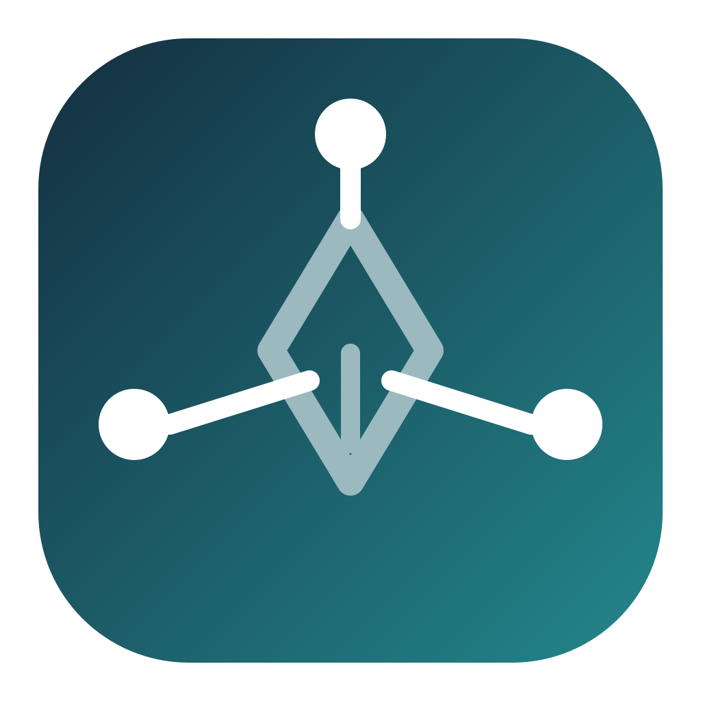
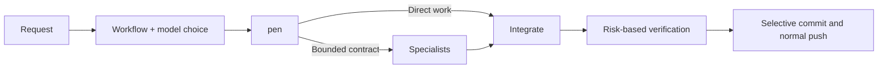

<div align="center">



# oh-pencode

### One primary agent. Seven specialists. One uninterrupted delivery loop.

An autonomous agent system installer for OpenCode V2.

[Install](#install) · [Agents](#agent-system) · [Models](#model-assignment) · [Goal and Claude compatibility](#goal-todo-and-claude-code-compatibility) · [Execution and recovery](#execution-and-recovery) · [Documentation](https://b-hs.github.io/oh-pen/docs/index.html)

</div>

oh-pencode installs `pen` as the single primary OpenCode V2 agent and hides the built-in `build` and `plan` agents. `pen` owns the request from understanding through delivery: it works directly or delegates to a specialist, reviews the integrated diff, runs proportionate verification, creates a Conventional Commit, and performs a normal push without repeatedly asking for routine approval.

| At a glance | Contract |
| --- | --- |
| Primary agent | `pen` |
| Specialists | `sub-pen`, `research-pen`, `explore-pen`, `doc-pen`, `verify-pen`, `security-pen`, `review-pen` |
| Models | Codex defaults, Claude defaults, primary inheritance, or any connected `provider/model#variant` |
| Session status | `/goal`, durable Todo state, and live right-sidebar display |
| Rules and commands | Claude Code `CLAUDE.md` and command directories linked into OpenCode V2 |
| Delivery | Verify → selective staging → commit → normal push |
| Install target | Global `~/.config/opencode/` only |
| Integrity | SHA-256 verification before installer execution |

## What's included in v0.4

- **Eight agents with clear roles:** one primary, seven specialists, and a new read-only `review-pen` for correctness and regressions.
- **Validated delegation:** explicit file ownership, completion criteria, required checks, and a shared DONE/PARTIAL/BLOCKED result format.
- **Native child sessions with per-call models:** a V2 plugin stages the contract, applies the selected model before child prompt admission, and validates the native result without editing installed model settings.
- **Reusable evidence:** research tied to source versions, file hashes, and expiry, with observed usage and completion metrics.
- **Goal and Todo sidebar:** `/goal` records one durable session objective while `pen_status` keeps the right sidebar current after every transition.
- **Claude Code compatibility:** the installer links global Claude rules and commands into the V2-native OpenCode paths instead of relying on a fallback that V2 does not implement.

The plugin keeps delegated work as a real OpenCode child session, so it has the current `pen` session as `parentID` and appears in the built-in subagent inspector. The bundled CLI runtime remains available for explicit recovery and compatibility workflows. See the [runtime guide](https://b-hs.github.io/oh-pen/docs/runtime.html) for the contract and operational limits.

## Install

Requirements: [OpenCode V2](https://opencode.ai/v2/docs/) and [Bun](https://bun.sh/).

```bash
curl -fsSL https://b-hs.github.io/oh-pen/install.sh | bash
```

The installer interviews you once for model assignment, shows the planned changes, verifies every downloaded asset against `manifest.json`, and backs up managed files before writing.

Preview the exact plan without changing files:

```bash
curl -fsSL https://b-hs.github.io/oh-pen/install.sh | bash -s -- --dry-run
```

Use the Codex model profile without the interview:

```bash
curl -fsSL https://b-hs.github.io/oh-pen/install.sh | bash -s -- --no-interview
```

Use the Claude model profile instead:

```bash
curl -fsSL https://b-hs.github.io/oh-pen/install.sh | bash -s -- --no-interview --models claude
```

After installation, start a new terminal so the Claude-rule-only environment setting is active. Run `verify` below, open OpenCode in your project, and select `pen` if it is not already the default. Give it your task and answer the workflow/model choices. Existing non-empty default-agent and root-model settings are preserved in non-interactive mode.

### Lifecycle commands

| Command | Purpose |
| --- | --- |
| `install` | Install the agent set and create a backup before managed writes |
| `verify` | Compare the installed files and OpenCode runtime interpretation with the manifest |
| `upgrade` | Refresh managed assets while preserving supported user changes |
| `uninstall` | Remove unchanged managed files and matching managed config keys; retain user edits and backups |

```bash
curl -fsSL https://b-hs.github.io/oh-pen/install.sh | bash -s -- verify
curl -fsSL https://b-hs.github.io/oh-pen/install.sh | bash -s -- upgrade
curl -fsSL https://b-hs.github.io/oh-pen/install.sh | bash -s -- uninstall
```

Uninstall does not restore an entire earlier configuration from backup. Before an upgrade, review any preserved-file warnings: a manually edited prompt or runtime stays unchanged unless you explicitly use `--force`.

## How it works

Before a new tool-using task begins, `pen` asks once for both choices:

1. Use the multi-agent workflow or let `pen` work directly.
2. Keep the installed Codex or Claude role defaults, inherit the primary model, or assign connected models per role.

The Codex profile uses GPT-6 Sol xhigh for `pen` and GPT-6 Luna max for every specialist. The Claude profile uses Claude Opus 5.5 high for `pen` and Claude Sonnet 5 xhigh for every specialist. After the answer, routine delivery proceeds without repeated approval prompts.



1. `pen` reads the request and project contract, then asks for workflow and model choices before using tools.
2. It works directly when workflow is declined, or assigns independent units to the relevant specialists when selected.
3. It checks specialist evidence against the actual files and diff, resolves overlap, and keeps integration ownership.
4. It runs the smallest verification that directly covers the changed risk.
5. For change requests, it selectively stages only the intended files, commits, and normally pushes.

The workflow stops only at a real boundary: new authority, secrets, a destructive or hard-to-recover operation, or a missing product decision that materially changes the requested contract.

## Agent system

| Agent | Ownership | Allowed surface |
| --- | --- | --- |
| `pen` | Request analysis, orchestration, integration, verification decision, commit, push | Project tools and normal Git; force push denied |
| `sub-pen` | Implementation inside a detailed work contract | Project tools; Git mutation and nested delegation denied |
| `research-pen` | External facts, constraints, and prerequisites | Read, search, web |
| `explore-pen` | Codebase structure, symbols, and established patterns | Read and search; no network or mutation |
| `doc-pen` | Official usage and API contracts that should remain with the project | Read, search, web, edit under `docs/**` except state, decisions, and history |
| `verify-pen` | Independent checks matched to the actual change risk | Read, search, approved check commands; no source or Git mutation |
| `review-pen` | Correctness, regressions, design, and project conventions | Read and search only |
| `security-pen` | Secrets, auth, input boundaries, injection, and dependencies | Read, search, web, package-manager audit commands |

Each specialist is intentionally narrower than `pen`. Subagents do not commit, push, or create nested subagents; the primary agent keeps a single integration and Git owner.

## Model assignment

The installer supports four assignment modes for every role:

- **Codex defaults:** `pen` uses `openai/gpt-6-sol#xhigh`; every specialist uses `openai/gpt-6-luna#max`.
- **Claude defaults:** `pen` uses `anthropic/claude-opus-5-5#high`; every specialist uses `anthropic/claude-sonnet-5#xhigh`.
- **Primary inheritance** uses the primary session model for a selected specialist.
- **Direct assignment** accepts any OpenCode-connected `provider/model#variant` value supplied by the user.

Assignments are installation defaults, not a permanent restriction. At each new tool-using task, `pen` offers the installed Codex and Claude profiles, primary-model inheritance, and direct per-role assignment. Installed profiles call OpenCode's native `subagent` tool directly. For inheritance or direct assignment, `pen` stages a validated contract with `pen_subagent`, then passes its unchanged `nextInput` to the native `subagent` tool. The plugin switches only the child session model during prompt admission and verifies the child `parentID`, agent, actual assistant model, and result. An unavailable model is reported instead of silently substituted.

If a staged native call fails, retry through `pen_subagent` again. Reusing the native input directly is rejected so a retry cannot fall back to the agent's installed default model.

Installation defaults live on the `model:` line in `~/.config/opencode/agents/<id>.md`. Task-specific choices do not edit those files or the root config. The primary session model is stored separately; a `model:` field inside `agents/pen.md` does not change an active primary session.

Reinstall and upgrade preserve a user-edited subagent `model:` line while refreshing managed prompts and permissions. Other manual prompt edits remain untouched unless `--force` is explicitly used.

## Goal, Todo, and Claude Code compatibility

Run `/goal <objective>` in the OpenCode TUI to set a durable session objective. `pen` writes the full task list through `pen_status`, keeps at most one item active, and replaces the state after each transition. The bundled TUI plugin reads the latest tool state reactively and appends Goal and Todo sections to OpenCode's right sidebar.

OpenCode V2 does not fall back to `CLAUDE.md` or `.claude/commands`. The installer therefore creates these live links:

```text
~/.config/opencode/AGENTS.md          -> ~/.claude/CLAUDE.md
~/.config/opencode/commands/<entry>   -> ~/.claude/commands/<entry>
```

The managed `/goal` command remains an OpenCode command beside those links. Nested Claude commands keep their paths, so `~/.claude/commands/llm-rules/verify.md` appears as `/llm-rules/verify`. The installer also adds `OPENCODE_DISABLE_PROJECT_CONFIG=1` to `~/.zshenv`, which makes OpenCode load the linked global Claude rule without adding project `AGENTS.md` files. Start a new terminal and a new OpenCode process after installation.

## Execution and recovery

Version 0.4 installs a server and TUI plugin pair, a Bun compatibility runtime, `/goal`, and JSON schemas alongside the agents. Normal delegated work uses the plugin and the native child session. Prepare the same validated contract shown in the [runtime guide](docs/pen/runtime.md); `pen_subagent` returns the exact native input, and `subagent` creates or resumes the child.

The compatibility runtime is still available for an explicitly separate CLI session or recovery workflow. Run these commands from that project's Git root.

```bash
bun ~/.config/opencode/oh-pencode/runtime.js validate docs/task.json
bun ~/.config/opencode/oh-pencode/runtime.js run docs/task.json
bun ~/.config/opencode/oh-pencode/runtime.js status <task-id>
bun ~/.config/opencode/oh-pencode/runtime.js cancel <task-id>
bun ~/.config/opencode/oh-pencode/runtime.js recover <task-id>
bun ~/.config/opencode/oh-pencode/runtime.js resume docs/task.json
bun ~/.config/opencode/oh-pencode/runtime.js metrics
```

Use `recover` only after the runner has stopped; it interrupts the server session before releasing the task lock. Resume requires the same contract and matching project state. A completed unchanged task returns its recorded result without calling the model again.

Defaults are 10 minutes, at most 2 attempts, and at most 2 read-only tasks at once. Each specialist has a 48-step ceiling; shared-checkout writes run serially. Add `.opencode/pen-state/` to the project's `.gitignore`. Missing token/cost data stays unknown. Shell permissions and snapshots are not an OS sandbox, and `pen` still checks the actual diff and reported evidence.

Automated tests cover contracts, permissions, installation, failure, cancellation, and resume. They do not make paid external-model calls; validate model connectivity in your own OpenCode environment.

## Autonomous Git boundary

`pen` is designed to finish routine requested work without another approval gate.

Automatically included:

- Proportionate build, type, test, and integrity checks
- Selective staging of the intended files
- Conventional Commit creation without AI trailers
- Normal push to the configured remote

Never automatic:

- Force push or history rewriting
- Secret, token, key, or `.env` access
- Destructive operations outside the explicit request
- Broad staging such as `git add -A`

Repository protection rules, authentication failures, and platform policy are reported rather than bypassed.

## Documentation behavior

`doc-pen` reads official documentation when a task depends on an external contract. If the source contains reusable setup, configuration, API usage, defaults, version differences, or project-specific cautions, it saves a concise derived guide under the project’s existing `docs/**` taxonomy.

When no taxonomy exists, the fallback is:

```text
docs/references/<topic>.md
```

One-off facts and material already covered by an existing page are returned to `pen` without producing another document. `docs/PROCESS.md` stays under the primary agent’s ownership.

## Install safety

- Downloads the bundle, manifest, and listed assets before execution, then verifies every SHA-256 digest.
- Writes managed OpenCode files under `~/.config/opencode/`, links existing `~/.claude` rule and command sources, and manages one environment line in `~/.zshenv`; there is no per-project install mode.
- Backs up `opencode.jsonc` and existing managed agents, plugin, runtime, and schema files before writing.
- Preserves managed files edited after installation and reports the conflict.
- Rejects absolute asset paths and paths containing `..`.
- Accepts only HTTPS or local development paths as asset sources.
- Does not use `sudo` or read secrets, tokens, keys, or `.env` files.

## Documentation

The [published documentation](https://b-hs.github.io/oh-pen/docs/index.html) is generated from the repository sources.

| Guide | Published page | Source |
| --- | --- | --- |
| Agent architecture | [Read](https://b-hs.github.io/oh-pen/docs/architecture.html) | [`docs/pen/architecture.md`](docs/pen/architecture.md) |
| Runtime and recovery | [Read](https://b-hs.github.io/oh-pen/docs/runtime.html) | [`docs/pen/runtime.md`](docs/pen/runtime.md) |
| Installer design | [Read](https://b-hs.github.io/oh-pen/docs/installer.html) | [`docs/pen/installer.md`](docs/pen/installer.md) |
| OpenCode V2 agent contract | [Read](https://b-hs.github.io/oh-pen/docs/v2-agents.html) | [`docs/opencode/v2-agents.md`](docs/opencode/v2-agents.md) |
| OpenCode V2 install surface | [Read](https://b-hs.github.io/oh-pen/docs/v2-install-surface.html) | [`docs/opencode/v2-install-surface.md`](docs/opencode/v2-install-surface.md) |
| Project decisions | [Read](https://b-hs.github.io/oh-pen/docs/decisions.html) | [`docs/acknowledge/decisions.md`](docs/acknowledge/decisions.md) |
| Work and verification state | [Read](https://b-hs.github.io/oh-pen/docs/process.html) | [`docs/PROCESS.md`](docs/PROCESS.md) |

## Development

```bash
bun install
bun run typecheck
bun test
bun run build:site
```

Exercise installation without touching the user configuration:

```bash
bun run src/cli.ts install --assets-dir ./dist/assets --dry-run --no-interview
bun run install:local -- --dry-run --no-interview
```

`bun run build:site` rebuilds `dist/` from scratch, bundles the installer, renders the documentation site, and records asset hashes in `dist/manifest.json`. A push to `main` runs type checking, tests, and the site build before GitHub Pages deployment.
